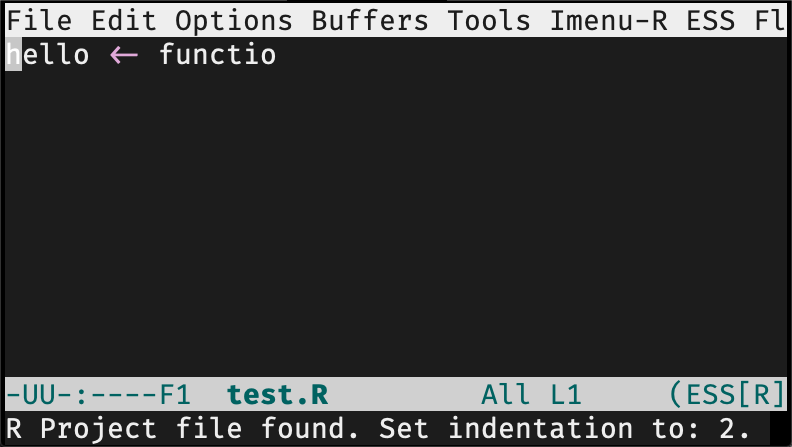

# ess_rproj



RStudio, we can be friend, right?

This elisp project seeks for .Rproj file in the current directory or the base directory of your current developing R package. And then set indentation of ESS according to the .Rproj file. Useful for ESS users surviving in this RStudio-dominant world.

## Installation

Download `ess-rproj.el` somewhere. Put this into your configuration file.

```lisp
(load-file "ess-rproj.el")
(add-hook 'ess-mode-hook #'ess-rproj)
```
